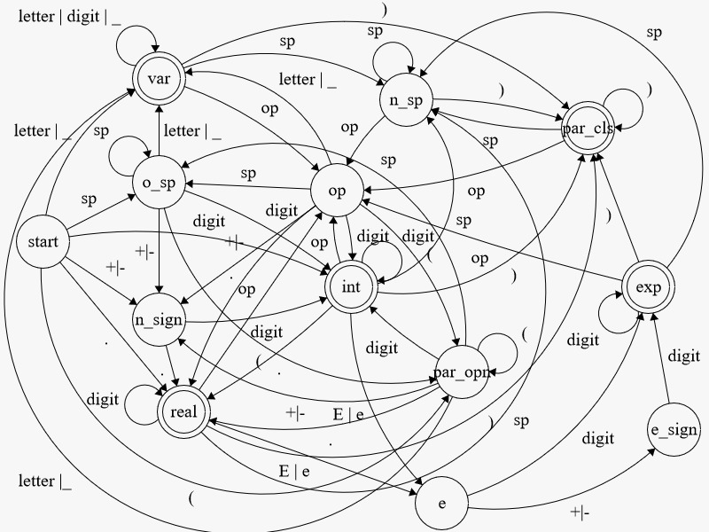
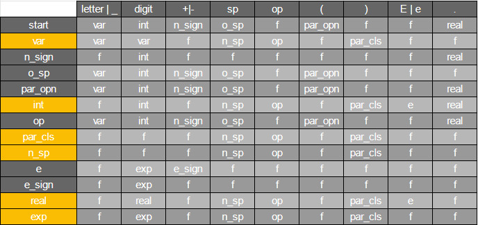

# Documentation for Automaton Program
 Mateo Herrera Lavalle - A01751912

 Gerardo Gutierrez Paniagua - A01029422
      
--- 
     
## User Manual 
     
To run program:

The language that the automaton is written in is racket, 
therefore in order to run the program a racket terminal is needed. 
The instalation of Dr. Racket editor and terminal should suffice 
to test or use the automaton.

   
How to use the automaton:

The first step in using the program is to open parenthesis
to call the main function with the specifications of the 
arithmetic expression that will define, this would 
take the form of:
    **(arithmetic-lexer**
  

Right after, open quotation marks and start typing the arithemtic 
expression. For example the expression could be 3.1E333 + 1 so 
then the test thus far should be:
    **(arithmetic-lexer "3.1E333 + 1**

To end the statement and the arithmetic expression, close 
quotation marks and parenthesis. Final stage of the example:
    **"(arithmetic-lexer "3.1E333 + 1")**

   

Exit or return:

The end result in the terminal for using the program 
correctly ought to be a list of lists of the tokens of the 
arithmetic expression identified element by element. 
For example:

When running:
    **(arithmetic-lexer "3.1E333 + 1")**

Return: 
    **'(("3.1E333" exp) ("+" op) ("1" int))**

Diagram of the automaton:

DFA Table:

